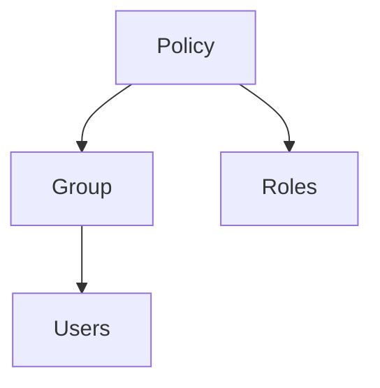

# IAM

In root account
- enable MFA
- create `admin` group
- create user acconunts for admins
- create users for amin groups (physical person)
  
General flow of creating IAM users/IAM groups
1. create group
1. create users
1. assign group to users
   

*[BP]* => inherit permissions from group
        => assign min amount of previlages to operate

IAM has already defined policy documents for ease of use. 
`PowerUser` role is like admin, it only *cannot* create IAM groups and IAM users

[Tip] IAM is not region specific

[Tip] Root account should not be used as everyday account

[Tip] Always setup password rotation

[Tip] *IAM Federation* is used for connecting via AD with SAML

[Tip] Password rotation policy have to be set-up

-----
## Definitions

**IAM User** -> pyhsical person

**IAM group** -> dev/admin etc

**IAM roles** -> internal usage within AWS

**IAM policy document** => role
                    => group -> users

