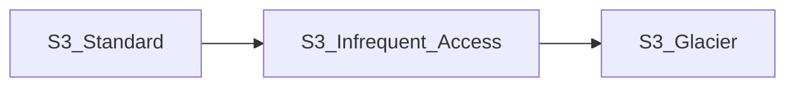

# S3

* Objects can be up to 5 TB
* All AWS accounts share same namespace, so bucket name mush be globally unique
* URLs: when a file is marked as public, its address is `https://<bucket-name>.s3.<region>.amazonaws.com/<key-name>`
* Uploading files: you will get HTTP 200.
* After data is written to S3, it is immediately available to use. 

## Types of S3 Storage 
### S3 Standad
- High availability and durability
- Designed for frequent access
- suitable for most workloads

### S3 Tiered Storage
Lifecycle management: We can define when to move data to other tiers.

Securing your data:
- Server side encryption
- ACLs per individual files
- Bucket policies: what actions are allowed/denied for certain groups/users/roles

### Object ACLs vs Bucket Policies

Object ACLs: individual object level
Bucket policy: this works on entire bucket level

**[Tip]** Buckets are private by default. To make public, first make bucket public and go to individual files and mark them as public as well

**[Tip]** Objects ACLS: You can make individual objects public using object ACLs

**[Tip]** Bucket policies: You can make entire buckets public using bucket policies

**[Tip]** You will get `HTTP-200` when upload is completed successfully. 

----

## Hosting Static Website

- S3 will do the capacity planning for websites, no need load balancers etc.
- Specify *index.html* and *error.html* to show in case of error.
- Add policy to make entire bucket public, add `s3:GetObject` permission
- S3 can scale automatically with demand.

----

## Versioning Objects

- can be great backup tool
- cannot be disabled, can be suspended
- can be intregrated with Lifecycle rules
- supports MFA (to delete objects)

- previous versions are not publicly acessible by default. Once there is newer version, old version need to be marked as public by the user.
  
- when versioning enabled, if an object is deleted, it is marked as deleted. To restore the file, delete the delete marker. 
 
**[Tip]** All versions of object are stored in S3

**[Tip]** Can be great backup tool

**[Tip]** Cannot be disabled, only suspended

----

## Storage Classes

### S3 Standard
  1. High availability and durability - files stored at least in 3 AZs
  2. DEsigned for frequent access
  3. Suitable for most workloads

### S3 Standard - Infrequent Access
  1. Rapid access when needed
  2. lower per-GB storage price and per-GB retrieval fee
  3. greate for long term storage

### S3 Standard - One Zone Infrequent Access
  1. Stored in single AZ
  2. Cost 20% less
  3. Great for long-lived, infrequently accessed, non-critical data

### Glacier
#### Option 1 - Glacier
  1. Cheap storage
  2. This is an archiving service
  3. Pay per access
  4. Retrieval time 1 min to 12 hours
  5. Optimized for very infrequently accessed data (few times per year)

#### Option 2 - Glacier Deep Archive
  1. Optimized for rarely accessed data (1-2 times per year)
  2. Retrieval time of 12 hours
  
### S3 Intelligent Tiering
 - Good when you are not sure whether to use data frequently or infrequently
 - Most cost optimized s3 option (for cost and quick access)

**[Tip]** S3 Standart is the highest cost

**[Tip]** S3 Intelligent tiering: cost optimized for unknown access patterns

**[Tip]** If retrieval free is not an issue, One-Zone infrequent access, Glacier or Glacier Deep archive is okay.

----

## Lifecycly Management

- User for saving cost on storing objects
- The flow can be defined differently among alternatives of S3 Tiers

**[Tip]** Automates moving objects between different storage tiers

**[Tip]** Can be using in conjuction with versioning

**[Tip]** Can be applied to current versions and previous versions, if versioning is enabled.

----

## Object locking S3 and Glacier

### S3 Object lock:
- object lock using WORM model
- WORM: write oqnce, read many times

#### Governance 
- mode: user cannot overwrite or delete an object version or alter its lock settings
- some of users can be granted permission to alter retention settings

#### Compliance Mode
- Protected object version cant be overwritten or deleted by any users
- retention period cannot be changed
- even root user cannot update these objects

#### Legal holds:
- prevents and object version from being overwritten or deleted
- permission is `s3:PutObjectLegalHold`
- Legal hold can be put/removed by any user
- legal hold is not associated retention period

### Glacier Vault Lock

Way of applying **WORM** model in glacier

**[Tip]** S3 Object lock to store objects using WORM model

**[Tip]** Object lock can be on individual objects or applied across the bucket

**[Tip]** Object Lock comes in two modes: governance mode and compliance mode.

**[Tip]** S3 Glacier vault lock
- easy deploy and enforce compliance controls
- specify controls in vault lock policty and lock the policy from future edits 
- once locked, can no longer be changed.

-----

## S3 Bucket Encyrption

- Can be enforced via bucket policy
  - bucket policy can deny all `PUT` requests that dont include the `x-ams-server-side-encryption` parameter in request header.
### Types of encryption
- in transit:
  - SSL/TLS
  - HTTPS
- encryption at rest: server side enctrption
  - SSE-S3: s3 managed keys, AES-256bit
  - SSE-KMS: KMS managed keys
  - SSE-C: Customer provided keys
- encryption at rest: client side enctrption
  - encrypt files before uploading to s3. 

----
## Optimize S3 Performance

User can get first byte within 100-200 ms. `PUT/COPY/POST/DELETE` 3500 req/sec, `GET/HEAD` 5500 req/sec

1. Better performance by spreading reads across different prefixes.
2. If we put same file to 4 different location, we can place 22000 req/sec `GET` request

### Limitations
- SSE-KMS has its own limits for encrpytion/decryption
- KMS has quota and cannot be increased, either 5500, 10000 or 30000 req/sec
- KMS performance is not equal accross regions

### Multipart Uploads
- Recommended for files over 100 MB
- REquired for files over 5 GB

### Downloads
- S3 Byte-Range Fetches: kind of multi-part download
- if there is failure, it is only for a specific byte range
- Download version of multi-part-upload

----

## Back-up data with S3 Replication

1. Replicate objects from one bucket to another
2. Objects in an existing bucket are not replicated automatically
   1. once turned on, all subseruqnet objects will be replicated automatically
3. by default delete markers are not replicated by default 
   - versioning must be enabled, in both source and destination bucket
  
4. Storage class of replicated bucket can be different (to save some money)

**[Tip]** Replicate objects from one bucket to another

**[Tip]** Objects in exsiting bucket are not replicated automatically

**[Tip]** Delete markers are not replicated by default, but can be configured so.
