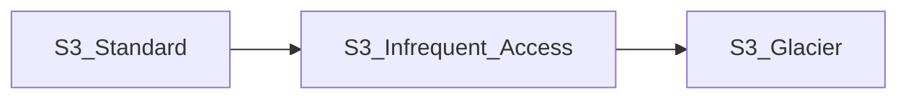

# S3

* Objects can be up to 5 TB
* All AWS accounts share same namespace, so bucket name mush be globally unique
* URLs: when a file is marked as public, its address is `https://<bucket-name>.s3.<region>.amazonaws.com/<key-name>`
* Uploading files: you will get HTTP 200.
* After data is written to S3, it is immediately available to use. 

## Types of S3 Storage 
### S3 Standad
- High availability and durability
- Designed for frequent access
- suitable for most workloads

### S3 Tiered Storage
Lifecycle management: We can define when to move data to other tiers.

Securing your data:
- Server side encryption
- ACLs per individual files
- Bucket policies: what actions are allowed/denied for certain groups/users/roles

### Object ACLs vs Bucket Policies

Object ACLs: individual object level
Bucket policy: this works on entire bucket level

**[Tip]** Buckets are private by default. To make public, first make bucket public and go to individual files and mark them as public as well

**[Tip]** Objects ACLS: You can make individual objects public using object ACLs

**[Tip]** Bucket policies: You can make entire buckets public using bucket policies

**[Tip]** You will get `HTTP-200` when upload is completed successfully. 

----

## Hosting Static Website

- S3 will do the capacity planning for websites, no need load balancers etc.
- Specify *index.html* and *error.html* to show in case of error.
- Add policy to make entire bucket public, add `s3:GetObject` permission
- S3 can scale automatically with demand.

----

## Versioning Objects

- can be great backup tool
- cannot be disabled, can be suspended
- can be intregrated with Lifecycle rules
- supports MFA (to delete objects)

- previous versions are not publicly acessible by default. Once there is newer version, old version need to be marked as public by the user.
  
- when versioning enabled, if an object is deleted, it is marked as deleted. To restore the file, delete the delete marker. 
 
**[Tip]** All versions of object are stored in S3

**[Tip]** Can be great backup tool

**[Tip]** Cannot be disabled, only suspended

----

## Storage Classes

### S3 Standard
  1. High availability and durability - files stored at least in 3 AZs
  2. DEsigned for frequent access
  3. Suitable for most workloads

### S3 Standard - Infrequent Access
  1. Rapid access when needed
  2. lower per-GB storage price and per-GB retrieval fee
  3. greate for long term storage

### S3 Standard - One Zone Infrequent Access
  1. Stored in single AZ
  2. Cost 20% less
  3. Great for long-lived, infrequently accessed, non-critical data

### Glacier
#### Option 1 - Glacier
  1. Cheap storage
  2. This is an archiving service
  3. Pay per access
  4. Retrieval time 1 min to 12 hours
  5. Optimized for very infrequently accessed data (few times per year)

#### Option 2 - Glacier Deep Archive
  1. Optimized for rarely accessed data (1-2 times per year)
  2. Retrieval time of 12 hours
  
### S3 Intelligent Tiering
 - Good when you are not sure whether to use data frequently or infrequently
 - Most cost optimized s3 option (for cost and quick access)

**[Tip]** S3 Standart is the highest cost

**[Tip]** S3 Intelligent tiering: cost optimized for unknown access patterns

**[Tip]** If retrieval free is not an issue, One-Zone infrequent access, Glacier or Glacier Deep archive is okay.

----

## Lifecycly Management

- User for saving cost on storing objects
- The flow can be defined differently among alternatives of S3 Tiers

**[Tip]** Automates moving objects between different storage tiers

**[Tip]** Can be using in conjuction with versioning

**[Tip]** Can be applied to current versions and previous versions, if versioning is enabled.